
Thank you for using **NUSConnect**! With **NUSConnect**, you can manage your contacts quickly and efficiently using the
Command Line Interface (CLI), all displayed with our custom-designed Graphical User Interface (GUI) specifically for
NUS students! Type fast, and **NUSConnect** lets you breeze through contact management tasks faster than any
traditional address book!

* Table of Contents
{:toc}

--------------------------------------------------------------------------------------------------------------------

## Quick start

1. First, make sure you have Java `17` or above installed in your computer! 
   **Mac users:** Check out [this guide](https://se-education.org/guides/tutorials/javaInstallationMac.html) to get the exact JDK version you need.

2. Next, download the latest `nusconnect.jar` file from [here](https://github.com/AY2425S2-CS2103T-T16-1/tp/releases).

3. Then, move `nusconnect.jar` to the folder where you want to keep your contacts.

4. Now, open up a command terminal, go to the folder where `nusconnect.jar` is, and use the `java -jar nusconnect.jar` command to
   run the application. You've just taken your first step toward managing contacts quickly!
   
5. You should now see some sample data. This is what NUSConnect will look like! For now, let's clear this data using:
   * `clear`. NUSConnect should now be empty.
6. Let's try a few commands! First, let's add your own contact to NUSConnect:
   * `add n/(your name) t/@(your handle)`. Substitute `(your name)` for your own name and `(your handle)` for your own Telgram handle!
7. Let's also add your phone number, and CS2103T as a course you are taking:
   * `edit 1 p/(your number) m/CS2103T`. We use `1` as that is the number currently written beside your name.
8. Now, you can extend this to add as many contacts as you want! Let us now add a new contact, John, who is your groupmate. To do this in just one command:
   * `add n/John Tan t/@johntan m/CS2103T`.
9. Since you and John are group members, let's create a group and add both contacts to it!
   * `group create CS2103T Group Project`.
   * `group add 1 to 1`. You have now added the first person to the first group.
   * `group add 2 to 1`. You have now added the second person to the first group.
10. Let's view John's details! Here, you will be able to see what other fields can be added to John.
    * `view 2`.
11. If you decide that you no longer need the group, you can remove it:
    * `group delete 1`.
12. But of course, once NUSConnect has been populated with real data, we do not want a "John" sticking around. Let's remove this using:
    * `delete 2`.
13. Now that you are done, you may save exit NUSConnect using:
    * `exit`.
14. For more features, refer to the [Features](#features) below!
15. Welcome to NUSConnect! We hope you will enjoy managing your contacts effortlessly!
* [Back to top](#nusconnect)

--------------------------------------------------------------------------------------------------------------------

## Command summary

| Action                                                   | Format, Examples                                                                                                                                                                                                                                             |
|----------------------------------------------------------|--------------------------------------------------------------------------------------------------------------------------------------------------------------------------------------------------------------------------------------------------------------|
| **[Add](#adding-a-person-add)**                          | `add n/NAME t/TELEGRAM [p/PHONE_NUMBER] [e/EMAIL] [a/ALIAS] [ma/MAJOR] [no/NOTE] [w/WEBSITE] [m/MODULE]…​`   e.g., `add n/John Doe t/@johndoe p/98765432 e/johnd@example.com a/alias123 ma/CompSci no/Enjoys programming w/https://johndoe.com m/CS2103T` |
| **[Edit](#editing-a-person-edit)**                       | `edit INDEX [n/NAME] [t/TELEGRAM] [p/PHONE] [e/EMAIL] [a/ALIAS] [ma/MAJOR] [no/NOTE] [w/WEBSITE] [m/MODULE]…​`  e.g.,`edit 2 n/James Lee e/jameslee@example.com`                                                                                          |
| **[Delete](#deleting-people-delete)**                    | `delete INDEX [MORE_INDICES]…​`  e.g., `delete 3` `delete 1 3 5`                                                                                                                                                                                          |
| **[Clear](#clearing-all-entries-clear)**                 | `clear`                                                                                                                                                                                                                                                      |
| **[Group create](#creating-a-group-group-create)**       | `group create NAME`  e.g., `group create CS2103T Team`                                                                                                                                                                                                    |
| **[Group delete](#deleting-a-group-group-delete)**       | `group delete INDEX`  e.g., `group delete 2`                                                                                                                                                                                                              |
| **[Group add](#adding-a-person-to-a-group-group-add)**   | `group add PERSON_INDEX to GROUP_INDEX`  e.g. `group add 1 to 2`                                                                                                                                                                                          |
| **[List](#listing-all-persons-list)**                    | `list`                                                                                                                                                                                                                                                       |
| **[Find](#locating-persons-by-name-or-modules-find)**    | `find KEYWORD [MORE_KEYWORDS]…​`  e.g., `find James Jake`                                                                                                                                                                                                 |
| **[View](#viewing-contact-details-view)**                | `view INDEX`   e.g., `view 1`                                                                                                                                                                                                                             |
| **[Sort](#sorting-the-address-book-sort)**               | `sort`                                                                                                                                                                                                                                                       |
| **[Export](#exporting-the-current-address-book-export)** | `export FILE_PATH`  e.g., `export exported_data.json`                                                                                                                                                                                                     |
| **[Import](#importing-an-address-book-import)**          | `import FILE_PATH`  e.g., `import exported_data.json`                                                                                                                                                                                                     |
| **[Help](#viewing-help-help)**                           | `help`                                                                                                                                                                                                                                                       |
| **[Exit](#exiting-the-program-exit)**                    | `exit`                                                                                                                                                                                                                                                       |
* [Back to top](#nusconnect)

--------------------------------------------------------------------------------------------------------------------

## Features

**:information_source: Notes about the command format:** 

* Words in `UPPER_CASE` are the parameters to be supplied by you. 
  e.g. in `add n/NAME`, `NAME` is a parameter which can be used as `add n/John Doe`.

* Items in square brackets are optional. 
  e.g `n/NAME [m/MODULE]` can be used as `n/John Doe m/CS2103T` or as `n/John Doe`.

* Items with `…`​ after them can be used multiple times including zero times. 
  e.g. `[m/MODULE]…​` can be used as ` ` (i.e. 0 times), `m/CS2103T`, `m/CS2103T m/CS2101` etc.

* Parameters can be in any order. 
  e.g. if the command specifies `n/NAME p/PHONE`, `p/PHONE n/NAME` is also acceptable.

* Extraneous parameters for commands that do not take in parameters (such as `help`, `list`, `exit` and `clear`) will be ignored. 
  e.g. if the command specifies `help 123`, it will be interpreted as `help`.

* If you are using a PDF version of this document, be careful when copying and pasting commands that span multiple lines as space characters surrounding line-breaks may be omitted when copied over to the application.

### Address Book Operations:

#### Adding a person: `add`

This command allows you to add a person to the address book.

Format: `add n/NAME t/TELEGRAM [p/PHONE] [e/EMAIL] [a/ALIAS] [ma/MAJOR] [no/NOTE] [w/WEBSITE] [m/MODULE]…​`

Examples:

After forming a group in CS2103T Software Engineering, you add your two teammates to NUSConnect:

* `add n/John Doe t/@johndoe p/98765432 e/john@u.nus.edu a/John no/Enjoys programming w/https://johndoe.com m/CS2103T`
* `add n/Betsy Crowe t/@bcrowe ma/Information Security no/Group Leader w/https://linkedin.com/betsycrowe m/CS2103T`

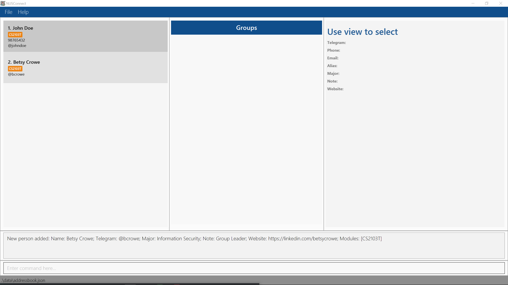

:bulb: **Note:**
NUSConnect will execute some basic parameter checking for you! Here are the minimum requirements for each field:

* Name: Starts with an alphanumeric character, and can contain alphanumeric characters, slashes, apostrophes, dashes, dots, spaces, and should not be blank.
* Telegram: Starts with an `@`, followed by 5 to 32 alphanumeric characters or underscores, and should not be blank.
* Phone: Is a number of 8 digits that starts with 9, 8, or 6, and should not be blank if specified on creation.
* Email: Accepts email addresses that can are usable by all major mail services (e.g., Gmail, Outlook), and should not be blank if specified on creation.
* Alias: Contains only alphanumeric characters, underscores, spaces, and should not be blank if specified on creation.
* Major: Contains only alphabets and spaces, and should not be blank if specified on creation.
* Note: Can take any value, and should not be blank if specified on creation
* Website: May start with `http://` or `https://`, followed by a valid URL.
* Module: Starts with 2 to 3 alphabets, followed by 4 numbers, and followed by 0 to 2 alphabets. This covers all standard modules in NUS.

:exclamation: **Warning:**
Each person must have a unique <strong>Name</strong>, <strong>Telegram</strong>, and <strong>Phone</strong> (if present). 
  Duplicates in any of these fields are not allowed.

:bulb: **For technical users:**
For "a valid URL", we have limited the Top Level Domain to be from 2 to 6 alphabets only, as this covers most legitimate student websites.

Common errors you may encounter:
* The Name and Telegram fields are missing: These are the most basic fields that persons in NUSConnect should have, remember to specify them!
* Adding an invalid field: NUSConnect will return the desired format that the field should be in. For example: `Telegram handles must start with an @, then the rest must be 5-32 characters long, case-insensitive,
and can only contain letters, numbers, underscores, and it should not be blank!`.
* Adding a duplicate person: Since two people are unlikely to share the same Telegram or Phone, NUSConnect will let you know if you are trying to add the same person! `The Telegram or Phone of the person you are trying to add already exists in the address book!"`.

#### Editing a person: `edit`

This command allows you to edit an existing person in the address book.

Format: `edit INDEX [n/NAME] [t/TELEGRAM] [p/PHONE] [e/EMAIL] [a/ALIAS] [ma/MAJOR] [no/NOTE] [w/WEBSITE] [m/MODULE]…​`

* Edits the person at the specified `INDEX`. The index refers to the index number shown in the displayed person list. The index **must be a positive integer** 1, 2, 3, …​
* At least one of the optional fields must be provided.
* Existing values will be updated to the input values.
* When editing modules, the existing modules of the person will be removed i.e adding of modules is not cumulative.

:bulb: **Note:**
When you are editing modules, the existing modules of the person will be removed, and replaced with what you have entered!

:bulb: **Tip:**
You can delete an optional parameter by specifying their prefixes (e.g., `p/`, `e/`, `a/`, `ma/`, `no/`, `w/`, and `m/`) without specifying any values!

  :exclamation: <strong>Warning:</strong> 
  Editing a person into an existing person with the same <strong>Telegram</strong> or <strong>Phone</strong> (if present) is not allowed. 

Examples:

You realize that you share an additional module, IS1108 Digital Ethics and Privacy, with John. You also realize you had mispelled Betsy's name, and they have dropped CS2103T.

*  `edit 1 m/CS2103T m/IS1108` Edits the modules of the 1st person to have both CS2103T and IS1108.
*  `edit 2 n/Betsy Crower no/ m/` Edits the name of the 2nd person to be `Betsy Crower`, clears the note, and clears all existing modules.

Common errors you may encounter:
* Editing a field to be invalid: NUSConnect will return the desired format that the field should be in. For example: `Telegram handles must start with an @, then the rest must be 5-32 characters long, case-insensitive,
and can only contain letters, numbers, underscores, and it should not be blank!`.
* Editing to duplicate person: Since two people are unlikely to share the same Telegram or Phone, NUSConnect will let you know if you are trying to edit to a duplicate person! `The Telegram or Phone cannot be modified to be the same as another person in the address book!"`.

#### Deleting people: `delete`

This command allows you to delete the specified person or a list of people from the address book.

Format: `delete INDEX [MORE_INDICES]…​`

* Deletes the person at the specified `INDEX`, or all people at the specified `INDICES`
* The index refers to the index number shown in the displayed person list.
* The indices **must be a positive integer** 1, 2, 3, ...
* The indices must not be larger than the size of the address book.

:bulb: **Tip:**
Duplicate indices are allowed! NUSConnect will delete the person specified at that index once.

:bulb: **Tip:**
The indices also do not have to be in any particular order!

Examples:

You heard that Betsy has dropped out of NUS, and will likely not need to keep in contact. You also do not want to keep some contacts you created to test out the features of NUSConnect.

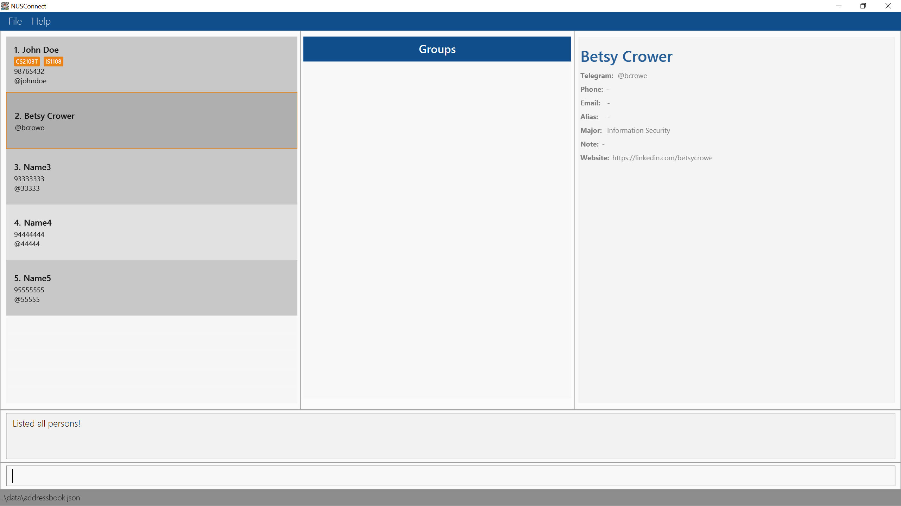

* `find Betsy` followed by `delete 1` deletes the 1st person in the results of the `find` command.

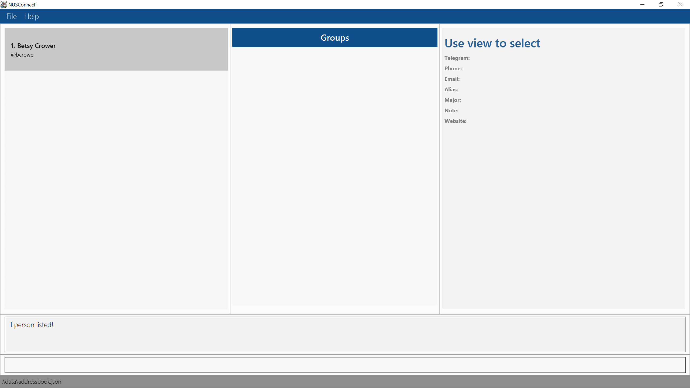

After `list` again:

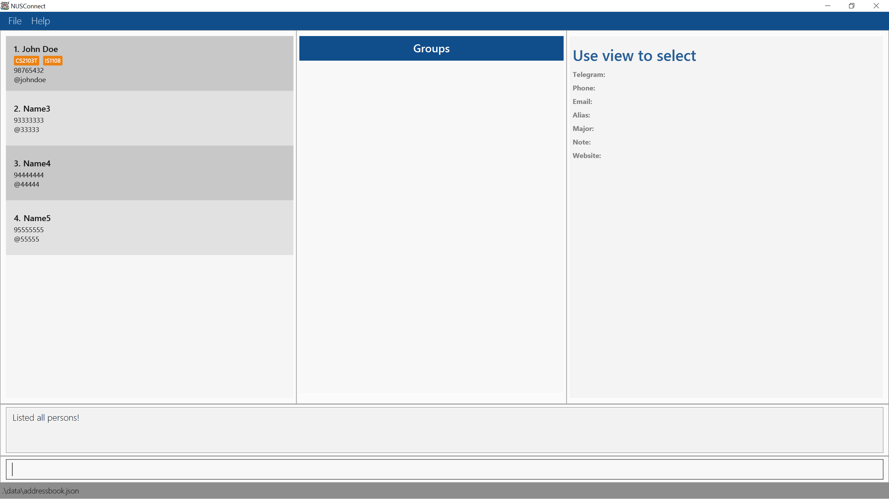

* `list` followed by `delete 2 4 3` deletes the 2nd, the 3rd, and the 4th person in the address book.

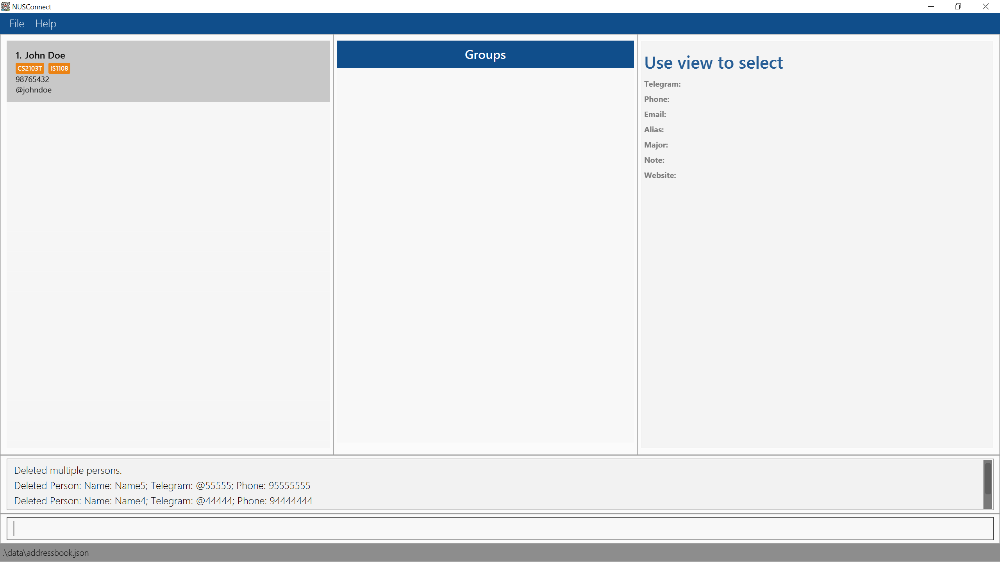

Common errors you may encounter:
* Invalid Indices: If you attempt to delete at an index which is higher than the number of people in the current list, NUSConnect will warn you about it! For example: `The following person index provided is invalid: 3`.

#### Clearing all entries: `clear`

This command allows you to clear all entries from the address book.

Format: `clear`

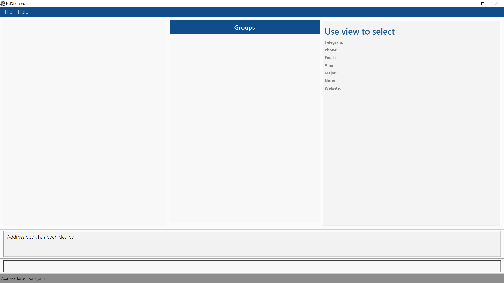

### Group Operations:

#### Creating a group: `group create`

This command allows you to create a new group with the specified name.

Format: `group create NAME`

* Creates a group with the specified `NAME`
* Shown on the group panel UI

Examples:
* `group create CS2103T Project Team` Creates a new group named "CS2103T Project Team"
* `group create Grey Hats` Creates a new group named "Grey Hats"

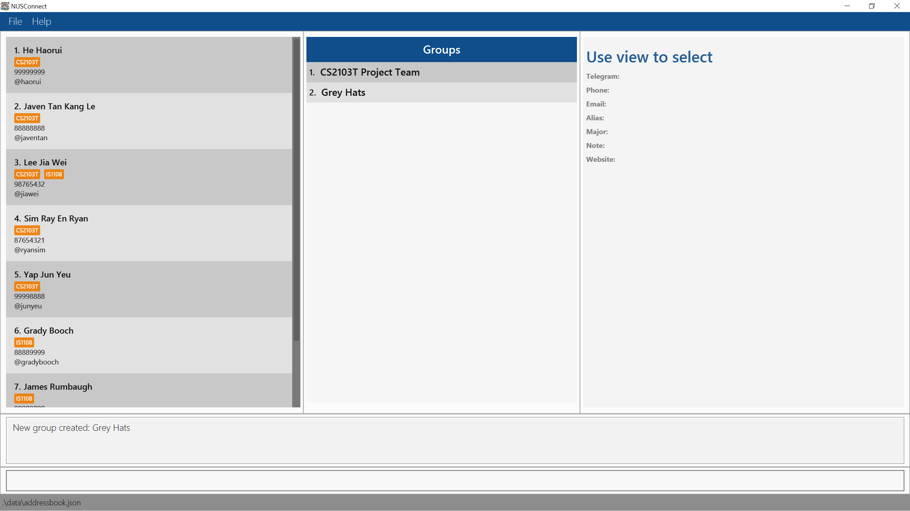

#### Adding a person to a group: `group add`

This command allows you to add a person to a group.

Format: `group add PERSON_INDEX to GROUP_INDEX`

* Adds the person at the specified `PERSON_INDEX` to the group at the specified `GROUP_INDEX`.
* Both indices refer to the index numbers shown in the displayed person list and group list respectively.
* Both indices **must be positive integers** 1, 2, 3, ...

Examples:
* `group add 2 to 1` Adds the 2nd person in the person list to the 1st group in the group list.
* `group add 2 to 2` Adds the 2nd person in the person list to the 2nd group in the group list.
* `group add 3 to 2` Adds the 3rd person in the person list to the 1st group in the group list.

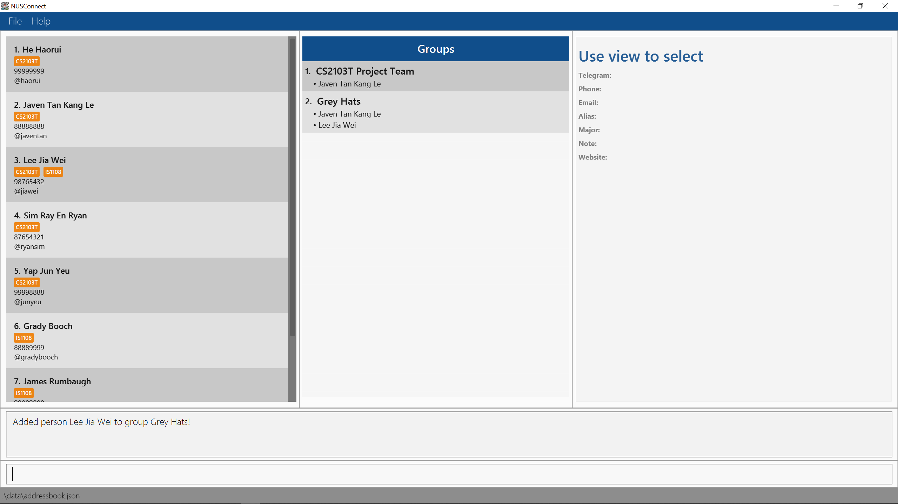

#### Deleting a group: `group delete`

This command allows you to delete the group at the specified index.

Format: `group delete INDEX`

* Deletes the group at the specified `INDEX`.
* The index refers to the index number shown in the displayed group list.
* The index **must be a positive integer** 1, 2, 3, ...

Examples:
* `group delete 1` Deletes the 1st group in the group list.

### Address Book Organization:

#### Listing all persons: `list`

This command allows you to show a list of all persons in the address book. This is useful to see all contacts again after filtering with another command, `find`.

Format: `list`

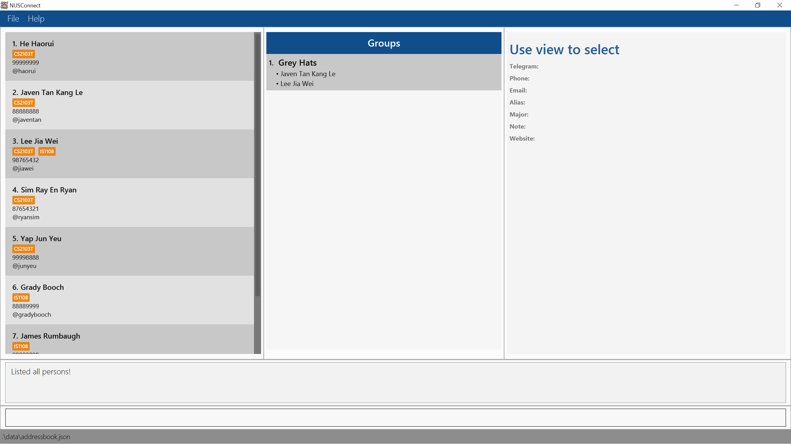

#### Locating persons by name or modules: `find`

This command allows you to find persons whose names or modules matches any of the entered keywords.

Format: `find KEYWORD [MORE_KEYWORDS]…​`

* The search is case-insensitive.
* Multiple keywords can be entered.
* The order of the keywords does not matter.
* Only the names and the modules are searched.
* Partial names and modules can be matched.
* Persons matching at least one keyword in either the name or module will be returned (i.e. OR search).

Examples:
* `find John` returns `john` and `John Doe`
* `find alex david` returns `Alex Yeoh`, `David Li`
* `find Tan Henry` returns `Henry Tan`
* `find tim` returns `Tim Yeoh`, `Timothy Lim`
* `find CS210` returns `John Doe` (matching `CS2100`), `Jerry Teo` (matching `CS2106`)
* `find doe CS2106` returns `John Doe` (matching name `Doe`) and `John Sim` (matching module `CS2106`)
  

#### Viewing contact details: `view`

This command allows you to view the details of the specified person from the address book.

Format: `view INDEX`

* Shows the full details of the person at the specified `INDEX` on the right panel.
* The index refers to the index number shown in the displayed person list.
* The index **must be a positive integer** 1, 2, 3, ...
* The index must not be larger than the size of the address book.

Examples:
* `list` followed by `view 2` shows the full details of the 2nd person in the address book.
* `find Betsy` followed by `view 1` shows the full details of the 1st person in the results of the `find` command.
  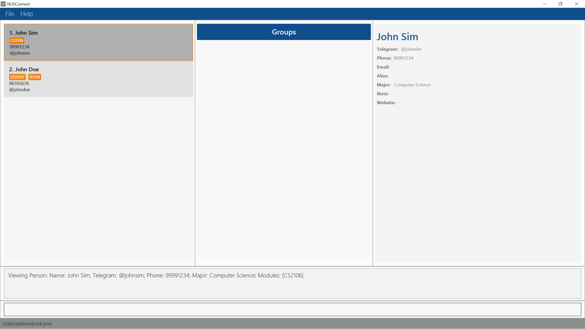

#### Sorting the address book: `sort`

This command allows you to sort all the persons in the address book by their names in alphabetical order. This is useful
for when you just want to organize and take a look at all your contacts!

Format: `sort`

* The `sort` command organises all the contacts in the address book by their names in ascending alphabetical order.
* If the address book is empty, the command will display the message `The address book is empty!`.
* If there is only one person in the address book, the list will remain unchanged, and the command will display the message `Sorted one person!`.

Examples:
* Before sorting: Note that "the three amigos" Grady Booch, James Rumbaugh, and Ivar Jacobson are not in alphabetical order.

* After sorting: Now, they have moved to the corresponding indices that will make all eight contacts be in alphabetical order!

### Storage:

#### Saving the data

AddressBook data are saved in the hard disk automatically after any command that changes the data. There is no need for you to save manually.

#### Editing the data file

AddressBook data are saved automatically as a JSON file `[JAR file location]/data/addressbook.json`. If you are an advanced user, you are welcome to update data directly by editing that data file.

:exclamation: **Caution:**
If your changes to the data file makes its format invalid, AddressBook will discard all data and start with an empty data file at the next run. Hence, it is recommended to take a backup of the file before editing it. 
Furthermore, certain edits can cause the AddressBook to behave in unexpected ways (e.g., if a value entered is outside of the acceptable range). Therefore, edit the data file only if you are confident that you can update it correctly.

#### Exporting the current address book: `export`

This command allows you to export the current address book data to a specified file. This means that you can create local
backups of your address book, or even share it to your contacts with others!

format: `export FILE_PATH`

* `FILE_PATH` refers to the location where the data will be exported. It can be either a relative or an absolute path. Examples for these paths are given below respectively.
* The file name (the last part of the `FILE_PATH`) cannot be empty; the file name should end with `.json` as file extension. (e.g. `addressbook.json`)
* If a file already exists at the specified location, it will be overwritten with the current data.
* If the file path is invalid or there are issues with writing the file (e.g., insufficient permissions, invalid characters), an error message will be displayed.

:bulb: **Note:**
`FILE_PATH` is normalized. E.g. `C:////////addressbook.json` is the same as `C:/addressbook.json`

Examples:

* `export C:/Users/user/Downloads/addressbook_backup.json` exports `addressbook_backup.json` to `C:/Users/user/Downloads`
* `export exported_data.json` exports the address book data to the `exported_data.json` file in the current directory.

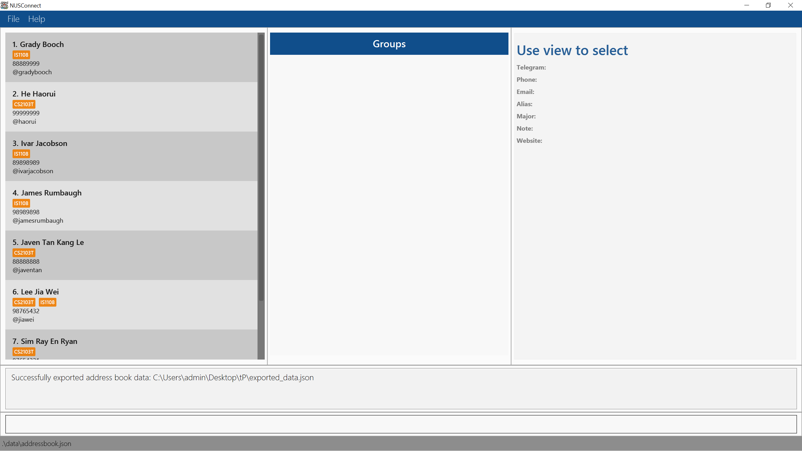

#### Importing an address book: `import`

This command allows you to import a specified file to the current address book. This means that you can change back to your local
backups of different address books, or even take a look at other's address books!

Format: `import FILE_PATH`

* `FILE_PATH` refers to the path of the file from which data will be imported. It can be either an absolute or relative path.
* The file name (the last part of the `FILE_PATH`) cannot be empty; the file name should end with `.json` as file extension. (e.g. `addressbook.json`)
* The file data must be in the correct format (`.json`), and it must contain data that is compatible with the address book structure.
* If the file path is invalid (e.g., insufficient permissions, invalid characters), the operation will fail, and an error message will be displayed.
* If the data in the file is successfully imported, the address book will be updated with the new information.

Examples:

* `import .json` imports data from the `.json` file within the current directory.
* `import backup/addressbook.json` imports data from the `addressbook.json` file located in the backup folder relative to the current directory.
* `import C:/Users/user/Documents/addressbook_data.txt` imports data from the `addressbook_data.txt` file located in the `C:/Users/user/Documents`
* `import exported_data.json` imports data from the `exported_data.json` file within the current directory.

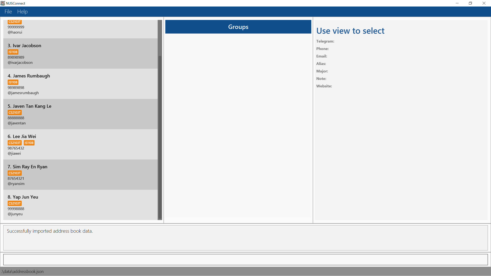

### Misc:

#### Viewing help: `help`

Shows a message explaning how to access the help page. This message can also be brought up using `F1`

Format: `help`

#### Exiting the program: `exit`

Exits the program.

Format: `exit`
* [Back to top](#nusconnect)

--------------------------------------------------------------------------------------------------------------------

## FAQ

**Q**: How is my data being used? 
**A**: All data is stored locally and is not collected or shared with external parties.

**Q**: Can I use NUSConnect without an internet connection? 
**A**: Yes, NUSConnect is a desktop application that operates fully offline. No internet connection is required to manage your contacts.

**Q**: How do I transfer my data to another Computer? 
**A**: Install the app in the other computer and overwrite the empty data file it creates with the file that contains the data of your previous AddressBook home folder.

**Q**: Can I undo a command if I delete or modify the wrong contact? 
**A**: Currently, there is no undo feature in NUSConnect. It is recommended to back up your address book data regularly to prevent accidental data loss.
* [Back to top](#nusconnect)

--------------------------------------------------------------------------------------------------------------------

## Known issues

1. **When using multiple screens**, if you move the application to a secondary screen, and later switch to using only the primary screen, the GUI will open off-screen. The remedy is to delete the `preferences.json` file created by the application before running the application again.
2. **If you minimize the Help Window** and then run the `help` command (or use the `Help` menu, or the keyboard shortcut `F1`) again, the original Help Window will remain minimized, and no new Help Window will appear. The remedy is to manually restore the minimized Help Window.
* [Back to top](#nusconnect)

--------------------------------------------------------------------------------------------------------------------

## Final words

Thank you once again for using **NUSConnect**! We hope that you will find our product beneficial, and that you will
enjoy managing your contacts seamlessly! We have included a command summary below for your reference. Should you have
any queries, please do not hesitate to reach out to any of us! Our contact details can be found in our [About Us Page](https://ay2425s2-cs2103t-t16-1.github.io/tp/AboutUs.html).
* [Back to top](#nusconnect)
